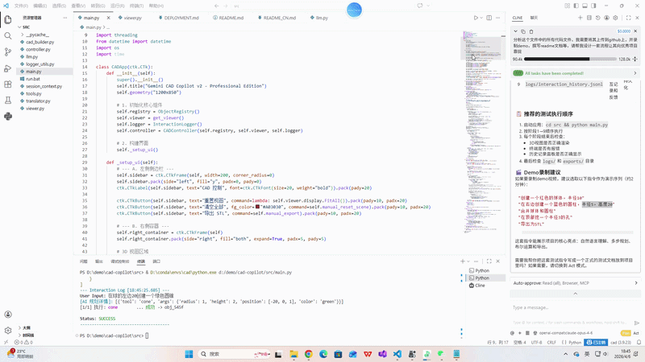

# 🤖CAD Copilot

> AI驱动的3D CAD建模助手 - 使用自然语言创建复杂3D模型

[](https://opensource.org/licenses/MIT)
[](https://www.python.org/downloads/)
[](https://github.com/tpaviot/pythonocc-core)

[English](README.md) | [中文文档](README_CN.md)

## ✨ 核心特性

- 🗣️ **自然语言交互** - 使用中英文指令创建3D模型
- 🧠 **AI智能规划** - GPT-4自动将指令转换为CAD操作序列
- 🎨 **实时3D可视化** - 基于OpenCASCADE的交互式3D查看器
- 🔧 **布尔运算** - 支持并集、差集、交集操作
- 📦 **STL导出** - 导出模型用于3D打印
- 📝 **操作日志** - 完整的历史记录和反馈系统
- 🎯 **智能ID解析** - 自动处理复杂多步操作的依赖关系

## 🚀 快速开始

### 环境要求

- Python 3.8+
- Conda（推荐用于安装PythonOCC）
- OpenAI API密钥

### 安装步骤

1. **克隆仓库**
```bash
git clone https://github.com/voidO-O/cad-copilot.git
cd cad-copilot
```

2. **创建conda环境并安装PythonOCC**
```bash
conda create -n cad python=3.10
conda activate cad
conda install -c conda-forge pythonocc-core
```

3. **安装Python依赖**
```bash
pip install -r requirements.txt
```

4. **配置API密钥**
```bash
cp .env.example .env
# 编辑 .env 文件，添加你的 OpenAI API 密钥
```

5. **运行应用**
```bash
cd src
python main.py
```

## 💡 使用示例

### 基础形状
```
"创建一个半径为10的球体"
"在右边添加一个半径5高度20的圆柱"
```

### 布尔运算
```
"合并球体和圆柱"
"在顶部减去一个小球体"
```

### 复杂建模
```
"创建一个带安装孔的轴承座"
"制作一个20齿的齿轮"
```

### 导出
```
"导出模型为STL格式"
```

## 🏗️ 项目架构

```
cad-copilot/
├── src/
│   ├── main.py              # GUI应用入口
│   ├── llm_real.py          # AI规划引擎
│   ├── controller.py        # 执行控制器
│   ├── cad_builder.py       # CAD几何体基元
│   ├── tools.py             # 工具注册表和实现
│   ├── viewer.py            # 3D可视化
│   ├── session_context.py   # 对象注册表和状态管理
│   └── logger_utils.py      # 交互日志记录
├── logs/                    # 操作日志
├── exports/                 # STL导出目录
└── requirements.txt         # Python依赖
```

## 🔑 核心组件

### AI规划引擎 (`llm_real.py`)
- 将自然语言转换为结构化JSON操作
- 处理复杂的多步骤规划
- 自动ID解析和依赖追踪

### CAD构建器 (`cad_builder.py`)
- 基础形状创建（球体、圆柱、圆锥、圆环）
- 布尔运算（并集、差集、交集）
- 变换操作

### 智能控制器 (`controller.py`)
- 顺序执行规划的操作
- 管理对象注册表和可见性
- 错误处理和恢复

## 📋 支持的操作

| 类别 | 操作 |
|------|------|
| **基础形状** | 球体、圆柱、圆锥、圆环 |
| **布尔运算** | 并集(Fuse)、差集(Cut)、交集(Common) |
| **变换** | 平移、缩放 |
| **管理** | 删除、重置、可见性控制 |
| **导出** | STL导出 |

## ⚙️ 配置说明

编辑 `.env` 文件进行配置：

```env
OPENAI_API_KEY=你的API密钥
OPENAI_BASE_URL=https://api.openai.com/v1
OPENAI_MODEL=gpt-4o-mini
```

## 🎬 Demo录制脚本

创建演示视频时，可以尝试以下场景：

1. **基础建模** (30秒)
   - "创建一个半径为10的球体"
   - "在位置[20, 0, 0]创建一个半径5高度20的圆柱"

2. **布尔运算** (30秒)
   - "合并球体和圆柱"
   - "在顶部创建一个小球体并减去它"

3. **复杂示例** (60秒)
   - "创建一个带安装孔的轴承座"
   - 展示AI的分步规划过程

4. **导出** (15秒)
   - "导出模型为 bearing_housing.stl"



## 🎥 录制建议

- **工具**: OBS Studio / ScreenToGif
- **分辨率**: 1920x1080 或 1280x720
- **帧率**: 30fps
- **格式**: MP4（详细演示）+ GIF（首页预览）
- **时长**: 总计约2-3分钟

## 🤝 贡献指南

欢迎贡献！请阅读 [CONTRIBUTING.md](CONTRIBUTING.md) 了解详情。

1. Fork 本仓库
2. 创建特性分支 (`git checkout -b feature/AmazingFeature`)
3. 提交更改 (`git commit -m 'Add some AmazingFeature'`)
4. 推送到分支 (`git push origin feature/AmazingFeature`)
5. 开启 Pull Request

## 📝 开源协议

本项目采用 MIT 协议 - 详见 [LICENSE](LICENSE) 文件

## 🙏 致谢

- [PythonOCC](https://github.com/tpaviot/pythonocc-core) - OpenCASCADE的Python绑定
- [CustomTkinter](https://github.com/TomSchimansky/CustomTkinter) - 现代化UI框架
- [OpenAI](https://openai.com/) - AI语言模型

## 📧 联系方式

项目链接: [https://github.com/voidO-O/cad-copilot](https://github.com/voidO-O/cad-copilot)

)

## ⚠️ 注意事项

1. **API密钥安全**: 请勿将 `.env` 文件提交到Git仓库
2. **PythonOCC安装**: 强烈建议使用conda安装，pip安装可能遇到编译问题
3. **性能**: 复杂模型可能需要较长的AI规划时间
4. **兼容性**: 目前在Windows 10/11上测试通过

---

⭐ 如果这个项目对你有帮助，请给个Star！
